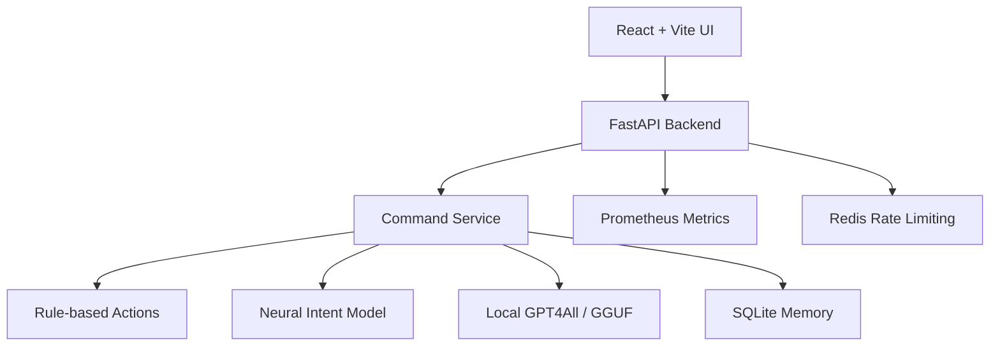
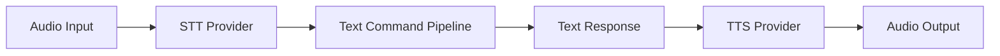

# Project Architecture: Meero Python 2.0

## 1. Frontend

The frontend is a React + Vite browser app. It owns browser microphone input,
typed command fallback, speech synthesis, assistant state, and the visual
assistant experience.

Key modules:

- `frontend/src/App.jsx` coordinates UI state, browser speech hooks, and backend
  `/command` calls.
- `frontend/src/hooks/useSpeechRecognition.js` handles Web Speech API input.
- `frontend/src/hooks/useSpeechSynthesis.js` handles browser text-to-speech.
- `frontend/src/api.js` reads `VITE_API_URL` and sends command requests.
- `frontend/src/utils/logger.js` keeps debug logs development-only.
- `frontend/src/components/ThreeOrb.jsx`, `Background.jsx`, and
  `HologramOverlay.jsx` render the assistant UI.

## 2. Backend

The backend is a FastAPI app exposed from `backend.app:app`.

Key modules:

- `backend/app.py` exposes `/`, minimal `/health`, protected `/debug/health`,
  `/command`, `/settings`, and `/metrics`. It also applies CORS, API-key
  protection, local-only settings protection, and per-client cooldown.
- `backend/command_service.py` preserves raw user text for LLM/memory fallback,
  normalizes text for action routing, and blocks desktop commands when local
  desktop mode is disabled or the request is not local.
- `core/actions.py` handles deterministic commands such as opening websites,
  controlling tabs, reporting time/date, screenshots, jokes, and system status.
- `core/actions_routing.py` defines command route specs used by the action
  engine and intent evaluation tests.
- `core/mock_engine.py` captures action responses for API responses instead of
  speaking them through a local desktop TTS engine.
- `core/memory_store.py` persists conversation history and summaries in a local
  SQLite database that is created at runtime.
- `ai/neural_net.py` loads canonical model artifacts for trained intent fallback.
- `ai/llm_engine.py` provides the optional local GGUF LLM fallback.

## 3. Runtime Data Flow

1. The browser captures speech or user interaction and produces text.
2. The frontend sends text to `POST /command`.
3. The backend checks local desktop safety rules, then runs rule-based actions
   first.
4. If no action route matches, the backend tries the neural intent model.
5. If the neural model cannot answer confidently, the backend tries the local
   GGUF LLM fallback.
6. The backend returns text, action status, sentiment, and metadata.
7. The frontend displays and speaks the response in the browser.

## 4. Safety And Configuration

Meero is local-first. Desktop automation is controlled by these environment
variables:

- `LOCAL_DESKTOP_MODE=true` allows local desktop-control commands.
- `WEB_SAFE_MODE=true` blocks desktop-control commands.
- `CORS_ORIGINS=http://localhost:5173` controls allowed frontend origins.
- `RATE_LIMIT_COOLDOWN=1.0` controls the per-client local cooldown.
- `MEERO_API_KEY` enables API-key checks for protected endpoints.
- `REQUIRE_API_KEY=true` makes protected endpoints fail closed when no key is
  configured.
- `APP_LAUNCH_ALLOWLIST` and `APP_CLOSE_ALLOWLIST` explicitly grant local app
  control; empty lists fail closed in local desktop mode.
- `APP_FORCE_CLOSE_ALLOWLIST` permits forced termination only for approved
  close targets.
- `AUDIT_LOG_COMMAND_TEXT=false` keeps spoken command and response text out of
  audit logs.

The `/settings` endpoint is local-only and accepts a strict schema for supported
assistant settings. `/health` is intentionally minimal; `/debug/health` exposes
detailed runtime diagnostics only after API-key checks pass.

## 5. Model Artifacts

Runtime model loading uses canonical artifact paths:

- `models/chat_model.h5`
- `models/tokenizer.pkl`
- `models/label_encoder.pkl`
- `models/manifest.json`

Training and packaging are handled by `scripts/train_and_package.py`. Generated
experiment artifacts, diagnostics, and local runtime databases are not part of
the source architecture.

## 6. Local Speech Roadmap

Browser Speech Recognition and SpeechSynthesis remain the v0.1.0-local runtime
providers. Future providers should preserve the same transcript-to-command and
response-to-speech boundaries:

- First local STT provider: Vosk. The repository already contains
  `scripts/setup_vosk.py` and model setup assets.
- Preferred local TTS provider: Piper.
- Lightweight Windows TTS fallback: Windows SAPI.
- External inference providers remain out of scope.
