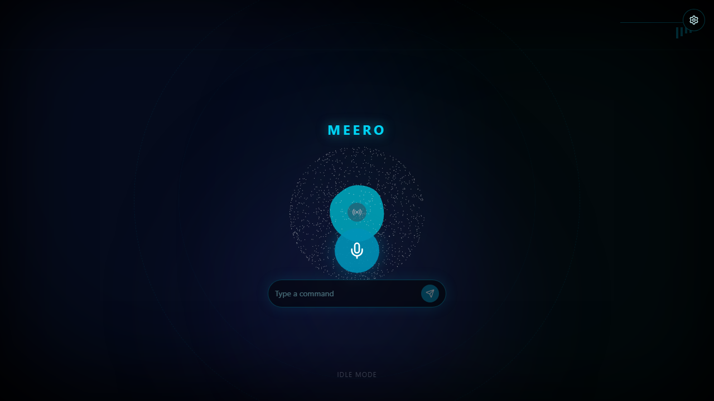
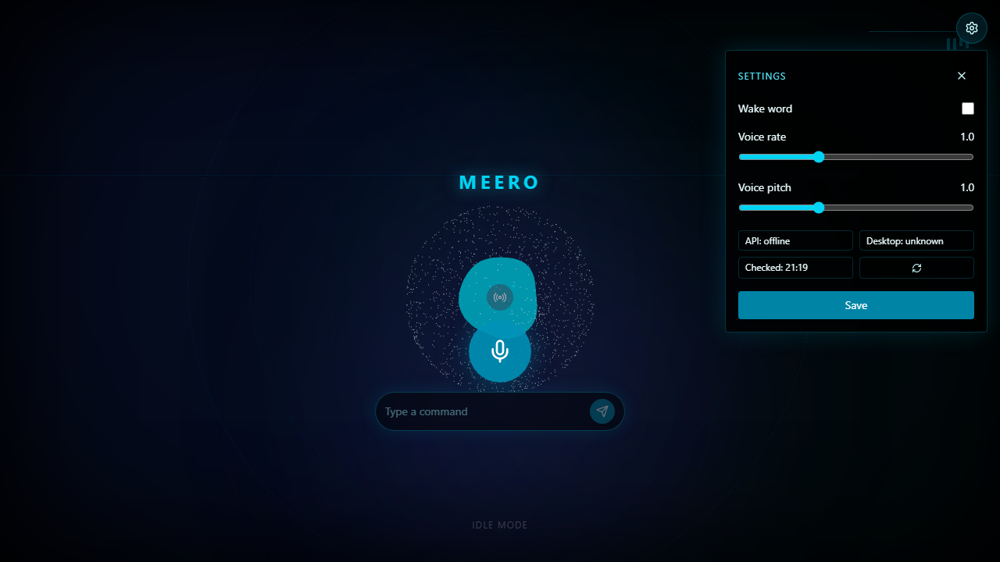
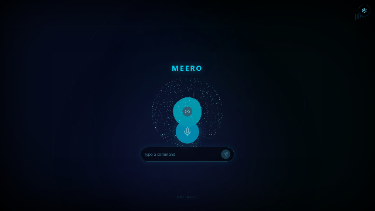
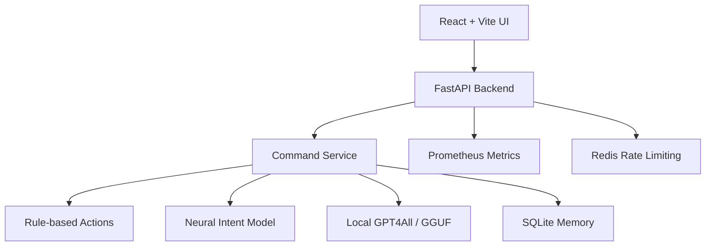

# Meero Python 2.0

[](https://github.com/Roshan-R-S/Meero/actions/workflows/ci.yml)
[](https://github.com/Roshan-R-S/Meero/actions/workflows/playwright.yml)
[](https://github.com/Roshan-R-S/Meero/actions/workflows/eval-on-main.yml)

Meero is a local-first AI desktop assistant with a FastAPI backend and a
React + Vite frontend. The browser UI handles speech recognition, typed
commands, and speech synthesis. The backend routes commands through deterministic
actions, neural intent fallback, optional local GGUF LLM fallback, memory,
metrics, and safety checks.

## Preview





## Local-First Safety

Meero can control local desktop features such as apps, tabs, scrolling, volume,
and screenshots. Treat it as a local assistant unless you add stronger
authentication and deployment controls.

For a concise deployment safety checklist, see [docs/SECURITY.md](./docs/SECURITY.md).

Desktop automation is guarded by environment flags:

- `LOCAL_DESKTOP_MODE=true` enables desktop-control commands.
- `WEB_SAFE_MODE=true` blocks desktop-control commands even when local mode is
  configured.
- `/settings` is local-only and accepts only validated settings keys.
- Optional API-key auth protects `/command` and `/settings` when
  `MEERO_API_KEY` is configured.
- Production-style deployments should set `REQUIRE_API_KEY=true` so a missing
  API key fails closed instead of disabling auth.
- Local desktop mode fails closed for app launch and close commands until their
  explicit allowlists are configured.
- Audit logs omit spoken command and response text by default.

## Safety Modes

| Mode | Description |
|---|---|
| `WEB_SAFE_MODE=true` | Blocks desktop/system control |
| `LOCAL_DESKTOP_MODE=true` | Allows local desktop automation for local requests |

For public or production-style deployment:

```env
WEB_SAFE_MODE=true
LOCAL_DESKTOP_MODE=false
```

For local assistant use:

```env
WEB_SAFE_MODE=false
LOCAL_DESKTOP_MODE=true
APP_LAUNCH_ALLOWLIST=notepad,calculator,paint,vscode
APP_CLOSE_ALLOWLIST=notepad,calculator,paint,vscode
APP_FORCE_CLOSE_ALLOWLIST=notepad
```

## Features

- React + Vite assistant interface with voice and typed command input
- Browser Speech Recognition and SpeechSynthesis support
- FastAPI command API with confirmation for sensitive actions
- Local desktop action routing guarded by desktop mode
- Neural intent fallback for trained conversational intents
- Optional local GPT4All / GGUF LLM fallback
- SQLite conversation memory
- Prometheus metrics
- Optional Redis-backed distributed rate limiting plus per-client local cooldown



## Requirements

- Python 3.10+
- Node.js 20.19+
- `pnpm`
- Docker Desktop, optional
- Redis, optional outside Docker

## Environment

Copy the examples if you need to customize local defaults:

```powershell
copy .env.example .env
copy frontend\.env.example frontend\.env
```

Backend variables:

```env
PYTHONUNBUFFERED=1
REDIS_URL=redis://localhost:6379/0
CORS_ORIGINS=http://localhost:5173
RATE_LIMIT_COOLDOWN=1.0
LOCAL_DESKTOP_MODE=false
WEB_SAFE_MODE=true
PROTECT_METRICS=false
APP_LAUNCH_ALLOWLIST=
APP_CLOSE_ALLOWLIST=
APP_FORCE_CLOSE_ALLOWLIST=
MEERO_API_KEY=change-this-local-key
REQUIRE_API_KEY=false
DEBUG_ERRORS=false
RATE_LIMIT_FAIL_OPEN=true
AUDIT_LOG_COMMAND_TEXT=false
MEMORY_MAX_INTERACTIONS=20
MEMORY_SUMMARY_MAX_CHARS=1200
```

When `LOCAL_DESKTOP_MODE=true`, empty launch or close allowlists block the
corresponding operation. `APP_FORCE_CLOSE_ALLOWLIST` only adds force-close
behavior for apps that are already permitted by `APP_CLOSE_ALLOWLIST`.

Frontend variables:

```env
VITE_API_URL=http://localhost:8000
VITE_MEERO_API_KEY=change-this-local-key
```

If `MEERO_API_KEY` is unset, API-key auth is disabled for local convenience. If
it is set, the frontend should send the same value through `VITE_MEERO_API_KEY`.
Do not treat `VITE_MEERO_API_KEY` as a public-web secret: Vite exposes frontend
environment variables in the browser bundle. Use it only for local/private
deployments, or put Meero behind real login, reverse-proxy auth, or a private
network.

## Quick Start

Backend:

```powershell
python -m venv .venv
.\.venv\Scripts\Activate.ps1
pip install -r requirements.txt
python -m uvicorn backend.app:app --reload --host 0.0.0.0 --port 8000
```

Frontend:

```powershell
cd frontend
pnpm install
pnpm run dev
```

Open `http://localhost:5173`.

Speech recognition works best in Chrome or Edge. If browser speech recognition
is unavailable, use the typed command input.

## Docker

### Development note about reload

When running the backend with `--reload` during development, the server watches
for file changes and restarts the worker process automatically. This is
convenient, but restarting will re-load heavy resources (the neural model and
local LLM), which can take several seconds. If you are iterating on UI or
lightweight backend code and want faster feedback, consider limiting reload
to specific files or restarting manually when model-loading changes are made.


Development compose runs the backend, Vite dev server, and Redis with bind
mounts:

```powershell
docker compose up --build
```

Production-style compose builds static frontend assets with nginx and keeps
desktop automation disabled:

```powershell
docker compose -f docker-compose.prod.yml up --build
```

For production-style runs, set a non-empty `MEERO_API_KEY` and keep:

```env
WEB_SAFE_MODE=true
LOCAL_DESKTOP_MODE=false
REQUIRE_API_KEY=true
```

See [docs/DEPLOYMENT.md](./docs/DEPLOYMENT.md) for supported deployment modes.

## Architecture



## Project Structure

- `backend/app.py` - FastAPI application entry point
- `backend/command_service.py` - command orchestration and fallback flow
- `core/actions.py` - deterministic action engine
- `core/actions_routing.py` - command route specifications
- `core/memory_store.py` - SQLite-backed memory
- `ai/neural_net.py` - neural intent runtime
- `ai/llm_engine.py` - optional local GPT4All / GGUF fallback
- `frontend/` - React + Vite UI
- `scripts/train_and_package.py` - canonical model training/packaging
- `scripts/evaluate.py` - model evaluation with accuracy gating

See [PROJECT_ARCHITECTURE.md](./PROJECT_ARCHITECTURE.md) for the runtime flow.

## Checks

Backend:

```powershell
python -m pytest -q
python scripts/secret_scan.py
```

Frontend:

```powershell
cd frontend
pnpm install --frozen-lockfile
pnpm lint
pnpm exec vitest run
pnpm run build
pnpm exec playwright test
```

Optional S3 upload dependencies:

```powershell
pip install -r requirements-cloud.txt
```

`requirements-cloud.txt` is only for publishing model artifacts. Meero does not
use cloud inference providers.

## CI

This repo's CI workflows run:

- backend pytest
- secret scan
- frontend Vitest
- frontend lint
- frontend build
- Playwright E2E
- model evaluation on main

## Training And Evaluation

Train canonical model artifacts after changing `intents.json`:

```powershell
python scripts/train_and_package.py --epochs 100 --batch 8 --out-dir models
```

Evaluate with the default minimum accuracy gate of `0.85`:

```powershell
python scripts/evaluate.py --out models/local_eval.json
```

The evaluation report includes accuracy, confidence stats, latency stats, and a
per-intent classification report.

Override the gate when needed:

```powershell
python scripts/evaluate.py --out models/local_eval.json --min-accuracy 0.80
```

Evaluate deterministic unseen and ASR-style voice routing separately:

```powershell
python scripts/evaluate_routes.py --eval-cases data/intent_eval_cases.json
python scripts/evaluate_routes.py --eval-cases data/voice_eval_cases.json
```

See [TRAINING.md](./TRAINING.md) for deterministic runner options.

## Known Limitations

- Desktop automation should not be exposed publicly.
- Speech recognition depends on browser support and microphone permission.
- Local GPT4All / GGUF fallback requires the configured model file to exist.
- Production Docker is a starting point, not a complete hosted deployment.

## Roadmap

- [x] Voice assistant UI
- [x] FastAPI command backend
- [x] Neural intent fallback
- [x] Local LLM fallback
- [x] SQLite memory
- [x] Redis rate limiting
- [x] Prometheus metrics
- [x] CI pipeline
- [x] API-key authentication
- [x] Production Docker Compose
- [x] Conversation history UI
- [x] Better model evaluation reports
- [x] Demo GIF and screenshots
- [x] Architecture diagram
- [x] Voice-specific routing evaluation
- [x] Fail-closed desktop app allowlists
- [x] Private-by-default audit logging
- [ ] Local Vosk STT runtime provider
- [ ] Local Piper TTS runtime provider
- [ ] Public deployment hardening
