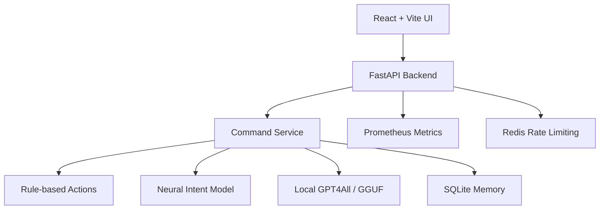
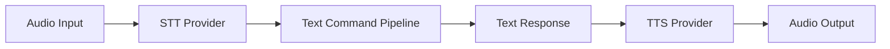

# Meero Architecture

## 1. Frontend

The frontend is a React + Vite browser app. It owns browser microphone input,
typed command fallback, speech synthesis, assistant state, and the visual
assistant experience.

Key modules:

- `frontend/src/App.jsx` coordinates UI state, browser speech hooks, and backend
  `/command` and `/voice-command` calls.
- `frontend/src/hooks/useAudioRecorder.js` and `useVoicePipeline.js` implement
  the preferred local push-to-talk request and audio playback path.
- `frontend/src/hooks/useSpeechRecognition.js` handles Web Speech API input.
- `frontend/src/hooks/useSpeechSynthesis.js` handles browser text-to-speech.
- `frontend/src/api.js` reads `VITE_API_URL` and sends command requests.
- `frontend/src/utils/logger.js` keeps debug logs development-only.
- `frontend/src/components/ThreeOrb.jsx`, `Background.jsx`, and
  `HologramOverlay.jsx` render the assistant UI.

## 2. Backend

The backend is a FastAPI app exposed from `backend.app:app`.

Key modules:

- `backend/app.py` exposes `/`, minimal `/health`, protected `/debug/health`,
  `/command`, `/settings`, and `/metrics`. It also applies CORS, API-key
  protection, local-only settings protection, and per-client cooldown.
- `backend/orchestrator/` is the single command gateway. It preserves raw text
  for memory and local LLM fallback, applies deterministic NLU only to routing,
  and enforces local desktop safety before actions run.
- `backend/command_service.py` is a compatibility facade for the orchestrator.
- `core/actions.py` handles deterministic commands such as opening websites,
  controlling tabs, reporting time/date, screenshots, jokes, and system status.
- `core/actions_routing.py` defines command route specs used by the action
  engine and intent evaluation tests.
- `core/response_collector.py` captures action responses for API responses
  instead of speaking them through a local desktop TTS engine.
- `core/mock_engine.py` temporarily preserves the old `MockSpeechEngine`
  import as a compatibility alias.
- `core/memory_store.py` persists conversation history and summaries in a local
  SQLite database that is created at runtime.
- `ai/neural_net.py` loads canonical model artifacts for trained intent fallback.
- `ai/llm_engine.py` provides the optional local GGUF LLM fallback.

## 3. Runtime Data Flow



1. The browser captures speech or user interaction and produces text.
2. The frontend sends text to `POST /command`.
3. The backend checks local desktop safety rules, then runs rule-based actions
   first.
4. If no action route matches, the backend tries the neural intent model.
5. If the neural model cannot answer confidently, the backend tries the local
   GGUF LLM fallback.
6. The backend returns text, action status, sentiment, and metadata.
7. The frontend displays and speaks the response in the browser.

## 4. Safety And Configuration

Meero is local-first. Desktop automation is controlled by these environment
variables:

- `LOCAL_DESKTOP_MODE=true` allows local desktop-control commands.
- `WEB_SAFE_MODE=true` blocks desktop-control commands.
- `CORS_ORIGINS=http://localhost:5173` controls allowed frontend origins.
- `RATE_LIMIT_COOLDOWN=1.0` controls the per-client local cooldown.
- `MEERO_API_KEY` enables API-key checks for protected endpoints.
- `REQUIRE_API_KEY=true` makes protected endpoints fail closed when no key is
  configured.
- `APP_LAUNCH_ALLOWLIST` and `APP_CLOSE_ALLOWLIST` explicitly grant local app
  control; empty lists fail closed in local desktop mode.
- `APP_FORCE_CLOSE_ALLOWLIST` permits forced termination only for approved
  close targets.
- `AUDIT_LOG_COMMAND_TEXT=false` keeps spoken command and response text out of
  audit logs.

The `/settings` endpoint is local-only and accepts a strict schema for supported
assistant settings. `/health` is intentionally minimal; `/debug/health` exposes
detailed runtime diagnostics only after API-key checks pass.

## 5. Model Artifacts

Runtime model loading uses canonical artifact paths:

- `models/chat_model.h5`
- `models/tokenizer.pkl`
- `models/label_encoder.pkl`
- `models/manifest.json`

Training and packaging are handled by `scripts/train_and_package.py`. Generated
experiment artifacts, diagnostics, and local runtime databases are not part of
the source architecture.

## 6. Local Speech

Local push-to-talk through Vosk/faster-whisper and Piper/SAPI is the preferred
voice path. Browser Speech Recognition and SpeechSynthesis remain explicit
fallback providers. Future providers should preserve the same
transcript-to-command and response-to-speech boundaries:



- Default local STT provider: Vosk, installed explicitly through
  `scripts/download_models.py`.
- Preferred local TTS provider: Piper.
- Lightweight Windows TTS fallback: Windows SAPI.
- External inference providers remain out of scope.

The local push-to-talk endpoint sends the resulting transcript through the
same orchestrator as typed commands, so it cannot bypass local-request,
desktop-mode, allowlist, or confirmation checks.

`AIOrchestrator` creates a fresh response collector and deterministic action
engine for each command through injectable factories. This keeps command state
request-scoped while allowing focused policy and trace tests.

Local STT provider models are loaded lazily and cached per `STTService`
instance. Model initialization and inference are locked so repeated local
requests reuse the model without sharing recognizer state.

### Voice Request Flow

1. The browser records a bounded 16 kHz mono 16-bit PCM WAV.
2. `POST /voice-command` validates and transcribes the audio locally.
3. The transcript enters the same orchestrator used by `POST /command`.
4. Piper, or Windows SAPI as fallback, may synthesize the response locally.
5. Request audio and temporary files are discarded.

Voice endpoints are local-only and API-key protected. Confirmation prompts and
cancellation responses use the same optional TTS finalization path as normal
responses. Piper and SAPI subprocesses are bounded by
`VOICE_TTS_TIMEOUT_SECONDS`.

The privacy-safe decision trace is ordered as:

```txt
stt -> voice_confirmation (when applicable) -> safety/actions/fallback -> tts
```

Trace steps may include provider, status, reason, confidence, and latency. They
never include audio, transcript text, command text, response text, or model
paths.

## 7. Latency Budgets

Decision traces record observed latency for voice stages, deterministic
actions, neural fallback, and local LLM fallback. These are operational targets,
not request-cancellation deadlines:

| Stage | Target |
| --- | ---: |
| STT | under 3 seconds |
| Deterministic actions | under 500 ms |
| Neural fallback | under 1 second |
| Local LLM | under 10 seconds, observed but not enforced |
| TTS | under 3 seconds |

Piper, SAPI, and supported desktop subprocesses have enforced timeouts. Vosk,
faster-whisper, and GPT4All require process isolation before their work can be
genuinely cancelled.

## 8. Repository Map

### Backend API And Security

- `backend/app.py`: FastAPI endpoints, CORS, auth, local-only checks, rate
  limiting, settings, model status, and metrics.
- `backend/schemas.py`: internal command-service outcome contract.
- `backend/telemetry.py`: private-by-default JSONL audit events.
- Relevant tests: `tests/test_server.py`, `tests/test_api_security.py`,
  `tests/test_cors.py`, `tests/test_telemetry.py`.

### Commands And Desktop Safety

- `backend/orchestrator/`: execution context, safety, deterministic actions,
  neural fallback, local LLM fallback, and privacy-safe decision traces.
- `backend/command_service.py`: compatibility facade for the orchestrator.
- `core/actions.py`: deterministic action implementations and matchers.
- `core/actions_routing.py`: ordered route definitions.
- `core/response_collector.py`: request-scoped deterministic response buffer.
- `app_launcher.py`: launch, close, and force-close allowlists.
- Relevant tests: `tests/test_actions.py`, `tests/test_app_launcher.py`,
  `tests/test_command_service.py`.

### Frontend Voice UX

- `frontend/src/App.jsx`: assistant state, confirmations, and command flow.
- `frontend/src/hooks/useSpeechRecognition.js`: wake word, push-to-talk, and
  continued conversation.
- `frontend/src/hooks/useSpeechSynthesis.js`: browser TTS and restart callback.
- `frontend/src/hooks/useHealthSettings.js`: persisted UI settings.
- Relevant tests: hook tests, `frontend/src/App.test.jsx`, and
  `frontend/tests/e2e/app.spec.js`.

### Local Voice

- `backend/voice/`: bounded WAV validation, Vosk/faster-whisper STT,
  Piper/SAPI TTS, and the voice-command pipeline.
- `frontend/src/hooks/useAudioRecorder.js`: local 16 kHz mono WAV capture.
- `frontend/src/hooks/useVoicePipeline.js`: push-to-talk request and playback.
- `scripts/download_models.py`: explicit checksum-verified model installation.

### AI And Evaluation

- `ai/neural_net.py`: neural intent runtime.
- `ai/llm_engine.py`: local GPT4All/GGUF fallback.
- `scripts/train_and_package.py`: canonical training and packaging.
- `scripts/evaluate.py`: model accuracy, confidence, and latency reports.
- `scripts/evaluate_routes.py`: deterministic unseen and voice routing gates.
- `data/intent_eval_cases.json`: deterministic routing and fallback cases.
- `data/voice_eval_cases.json`: ASR-style voice evaluation cases.

### CI And Deployment

- `.github/workflows/ci.yml`: backend, frontend, deployment, and image checks.
- `.github/workflows/eval-on-main.yml`: training and routing evaluation gates.
- `requirements-test.txt`: lightweight test dependencies.
- `requirements-test-full.txt`: lightweight plus AI dependencies.
- Dockerfiles and Compose files: local and production runtime variants.

Generated caches, virtual environments, frontend builds, runtime databases,
settings, audit logs, voice cache, downloaded models, model reports, and local
GGUF files must not be committed.
